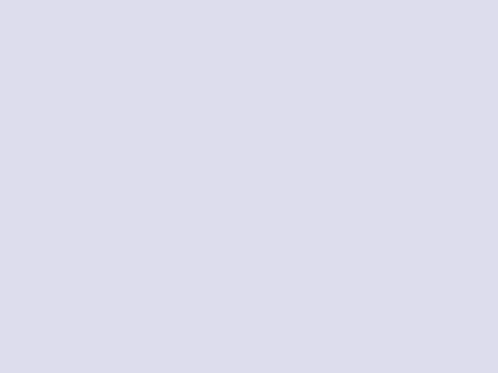

# testcafe-repro-screenshot-mark-macos-14

This repository reproduces the issue with macOS 14, where TestCafe is unable to
locate the page area mark and shows a warning.

There are example screenshots for different platforms/browsers at `./screenshots/`.

## Safari Results


*Test "Screenhot" - in Safari*

```txt
% npm run test

> testcafe-repro-screenshot-mark-macos-14@1.0.0 test
> testcafe safari screenshot.tc.ts

(node:5212) [DEP0040] DeprecationWarning: The `punycode` module is deprecated. Please use a userland alternative instead.
(Use `node --trace-deprecation ...` to show where the warning was created)
 Running tests in:
 - Safari 17.3.1 / Sonoma 14

 screenshot
 ✓ screenshot (screenshots: /Users/xxx/testcafe-repro-screenshot-mark-macos-14/screenshots/safari--screenshot.png)


 1 passed (3s)

 Warnings (1):
 --
  Unable to locate the page area in the browser window screenshot at /Users/xxx/testcafe-repro-screenshot-mark-macos-14/screenshots/safari--screenshot.png, because the page area
  mark with ID 3194121322 is not found in the screenshot.
```

## Chrome Results


*Test "Screenhot" - in Chrome*

```txt
% npm run test:chrome 

> testcafe-repro-screenshot-mark-macos-14@1.0.0 test:chrome
> testcafe chrome screenshot.tc.ts

(node:5278) [DEP0040] DeprecationWarning: The `punycode` module is deprecated. Please use a userland alternative instead.
(Use `node --trace-deprecation ...` to show where the warning was created)
 Running tests in:
 - Chrome 122.0.0.0 / Sonoma 14

 screenshot
 ✓ screenshot (screenshots: /Users/xxx/testcafe-repro-screenshot-mark-macos-14/screenshots/chrome--screenshot.png)


 1 passed (5s)
 ```
